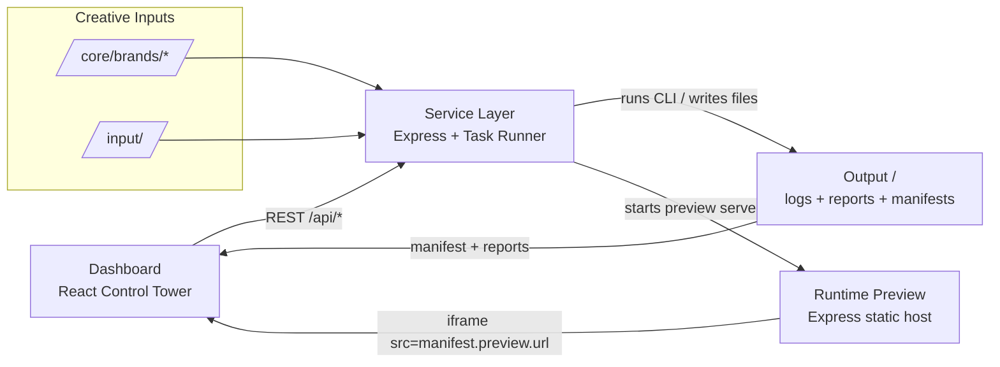

## Deemind Dashboard — Control Tower Guide

The dashboard is a **read-only control surface**. It never edits files, shells out to Node scripts, or mutates runtime
state directly. All actions flow through the service API and every view is backed by artifacts already produced in
`/output/*`.

### Architecture Diagram



### Core Screens

| Screen                 | Purpose                                                                                                                     | Data Source(s)                                                                                            |
| ---------------------- | --------------------------------------------------------------------------------------------------------------------------- | --------------------------------------------------------------------------------------------------------- |
| **Brands & Identity**  | Lists every built theme and its manifest metadata (version, pages, preview routes).                                         | `GET /api/themes`                                                                                         |
| **Build & Validation** | Enqueue builds and review validator output. Build buttons call the runner; validation panel renders `report-extended.json`. | `GET /api/themes`, `GET /api/status`, `POST /api/run { cmd:"build" }`, `GET /api/reports/:theme/extended` |
| **Reports & Logs**     | JSON viewer for the extended report plus the live service log stream. No hidden commands.                                   | `GET /api/reports/:theme/extended`, `GET /api/log/history`, `/api/log/stream`                             |
| **Preview & Delivery** | Renders each theme’s preview iframe using the manifest metadata and provides a package trigger.                             | `GET /api/themes`, `POST /api/run { cmd:"package" }`                                                      |

Switching to “Developer mode” in the UI only reveals additional metadata; it does **not** unlock new actions.

### API Endpoints

All dashboard calls are proxied through the service; React never touches the filesystem.

```
GET  /api/themes                      -> [{ name, manifest }]
GET  /api/status                      -> { current, queue }
POST /api/run { cmd, theme, args? }   -> enqueue CLI command (build/package)
GET  /api/reports/:theme/extended     -> contents of output/<theme>/report-extended.json
GET  /api/log/history                 -> last 200 log entries (JSON)
GET  /api/log/stream                  -> SSE stream of log entries
```

### Manifest Preview Contract

Every build now writes `output/<theme>/manifest.json` with preview metadata so the dashboard can load the correct
iframe per theme without guessing ports:

```json
{
  "theme": "demo",
  "buildTime": "2025-11-09T13:27:10.934Z",
  "preview": {
    "port": 3007,
    "url": "http://localhost:3007/",
    "routes": ["/", "/pages/about"]
  },
  "reports": {
    "extended": "output/demo/report-extended.json",
    "core": "output/demo/report.json"
  }
}
```

If the preview server is disabled the `preview.url` field is `null`, but the shape of the manifest stays the same so the
UI can render a consistent fallback.

### Operational Boundaries

- Dashboard = visualization + API calls only.
- Service = builds, validation, packaging, preview metadata emission.
- Runtime = preview server bound to the manifest’s `preview.port`.
- `/output/*` remains disposable; the dashboard just reads whatever the service produced.

When adding new features, extend the service API first, then point the dashboard at it. Never import `fs`, `child_process`
or any `tools/*` module from React.\*\*\* End Patch
