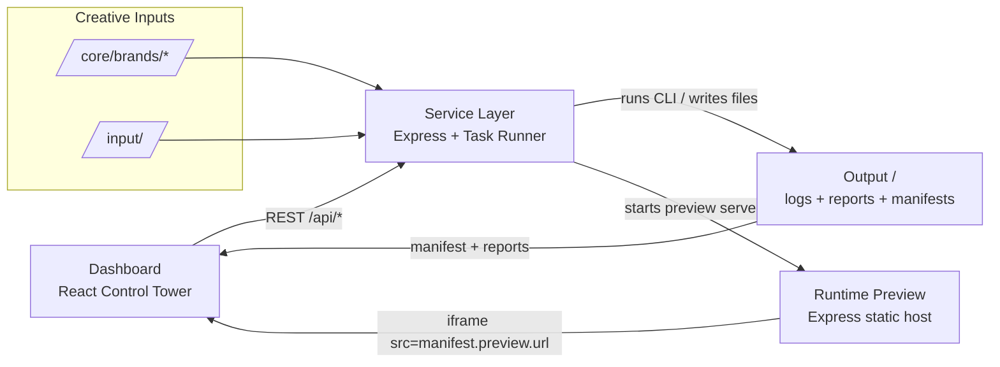

## Deemind Dashboard — Control Tower Guide

The dashboard is a **read-only control surface**. It never edits files, shells out to Node scripts, or mutates runtime
state directly. All actions flow through the service API and every view is backed by artifacts already produced in
`/output/*`.

### Brand Wizard toggle

Brand DNA files under `core/brands/*.json` are treated as **canonical seed data**. They are hydrated into presets and
fed back into the manufacturing pipeline, but the dashboard never mutates them directly. The `/api/brands` routes remain
available by default for the Brand Wizard (“Creative” tab). To temporarily disable this surface (and hide the tab), set
`ENABLE_BRANDS=false` in `.env`; both the service router and React navigation will respect the flag without further code
changes.

### Architecture Diagram



### Integration Layers

```
┌──────────────────────────────────────────────┐
│                 Dashboard UI                │
│ (React, read-only, fetches /api/* only)     │
└──────────────────┬───────────────────────────┘
                   │ REST / JSON
┌──────────────────┴───────────────────────────┐
│               Service Layer                 │
│ (Express + TaskRunner, owns mutations)      │
└──────────────────┬───────────────────────────┘
                   │ CLI / File IO
┌──────────────────┴───────────────────────────┐
│               Core / Tools                  │
│ (Canonical, adapters, validators, runtime)  │
└──────────────────────────────────────────────┘
```

| Layer         | Responsibilities                                                                            | Allowed Operations                          |
| ------------- | ------------------------------------------------------------------------------------------- | ------------------------------------------- |
| Dashboard UI  | React “control tower” that renders manifests, logs, and previews by calling `/api/*`.       | Fetch JSON/SSE, render data, no FS/CLI.     |
| Service Layer | Express middleware + task runner that mutates state, triggers CLI builds, handles brands.   | Run Node/CLI commands, write `/output/*`.   |
| Core / Tools  | Canonical themes, adapters, validators, and runtime scripts invoked by the service runners. | Full filesystem + process access as needed. |

### Mode System & Permissions

The dashboard ships with two presentation modes managed by `ModeContext`:

- **Friendly Mode** — read-only surface for non-technical stakeholders. They can inspect manifests, logs, reports, and
  previews but every action button is hidden/disabled, so no file writes or CLI jobs can be requested.
- **Developer Mode** — exposes additional controls (build/package buttons, CLI task runner, preset editors) but still
  routes everything through the Service API. The UI never shells out or touches the filesystem directly.

Every REST call tags requests with `X-Deemind-Source: dashboard` and `X-Deemind-Mode`. The service honors those tags and
enforces real mutations server-side. UI-triggered builds are only allowed when `ALLOW_UI_BUILD=true` is present in `.env`
—leave it unset or set to `false` to hard-block build requests even if someone tampers with the frontend.

### Core Screens

| Screen                 | Purpose                                                                                                                     | Data Source(s)                                                                                            |
| ---------------------- | --------------------------------------------------------------------------------------------------------------------------- | --------------------------------------------------------------------------------------------------------- |
| **Brands & Identity**  | Lists every built theme and its manifest metadata (version, pages, preview routes).                                         | `GET /api/themes`                                                                                         |
| **Build & Validation** | Enqueue builds and review validator output. Build buttons call the runner; validation panel renders `report-extended.json`. | `GET /api/themes`, `GET /api/status`, `POST /api/run { cmd:"build" }`, `GET /api/reports/:theme/extended` |
| **Reports & Logs**     | JSON viewer for the extended report plus the live service log stream. No hidden commands.                                   | `GET /api/reports/:theme/extended`, `GET /api/log/history`, `/api/log/stream`                             |
| **Preview & Delivery** | Renders each theme’s preview iframe using the manifest metadata and provides a package trigger.                             | `GET /api/themes`, `POST /api/run { cmd:"package" }`                                                      |

Switching to “Developer mode” in the UI only reveals additional metadata; it does **not** unlock new actions.

### API Endpoints

All dashboard calls are proxied through the service; React never touches the filesystem.

```
GET  /api/themes                      -> [{ name, manifest }]
GET  /api/status                      -> { current, queue }
POST /api/run { cmd, theme, args? }   -> enqueue CLI command (build/package)
GET  /api/reports/:theme/extended     -> contents of output/<theme>/report-extended.json
GET  /api/log/history                 -> last 200 log entries (JSON)
GET  /api/log/stream                  -> SSE stream of log entries
```

### Manifest Preview Contract

Every build now writes `output/<theme>/manifest.json` with preview metadata so the dashboard can load the correct
iframe per theme without guessing ports:

```json
{
  "theme": "demo",
  "buildTime": "2025-11-09T13:27:10.934Z",
  "preview": {
    "port": 3007,
    "url": "http://localhost:3007/",
    "routes": ["/", "/pages/about"]
  },
  "reports": {
    "extended": "output/demo/report-extended.json",
    "core": "output/demo/report.json"
  }
}
```

If the preview server is disabled the `preview.url` field is `null`, but the shape of the manifest stays the same so the
UI can render a consistent fallback.

### Operational Boundaries

- Dashboard = visualization + API calls only.
- Service = builds, validation, packaging, preview metadata emission.
- Runtime = preview server bound to the manifest’s `preview.port`.
- `/output/*` remains disposable; the dashboard just reads whatever the service produced.

When adding new features, extend the service API first, then point the dashboard at it. Never import `fs`, `child_process`
or any `tools/*` module from React.\*\*\* End Patch
